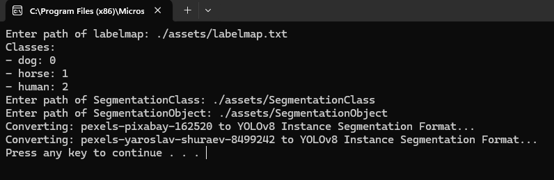
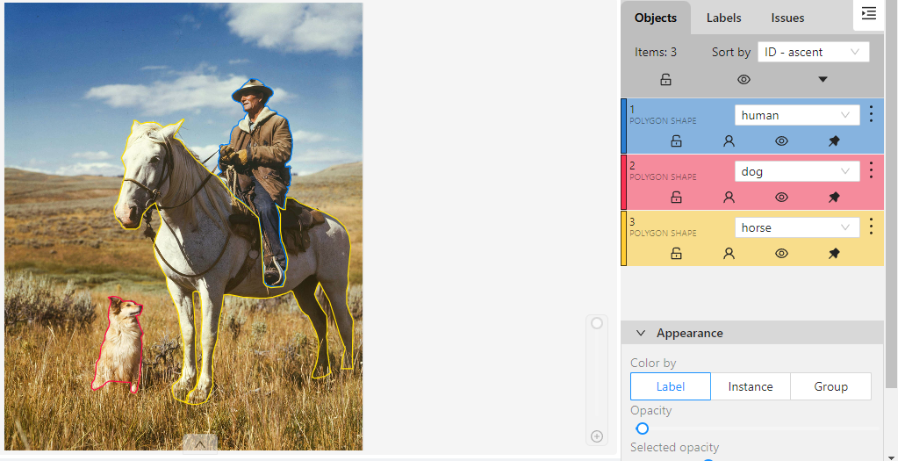
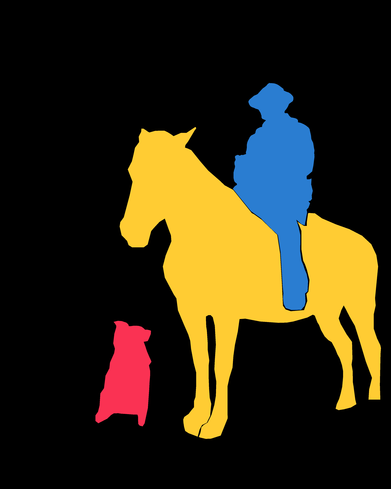
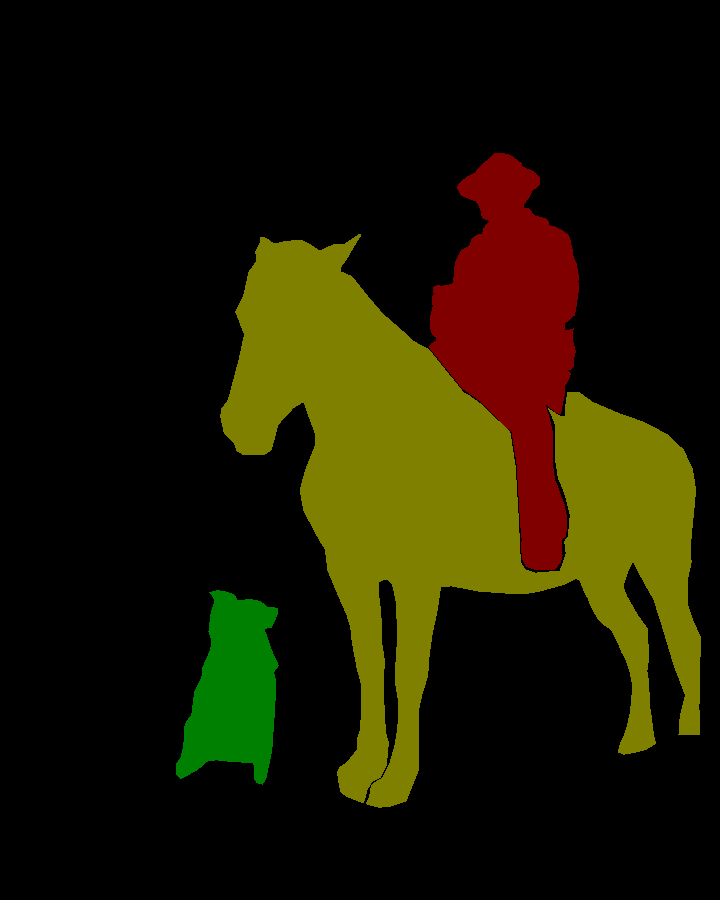
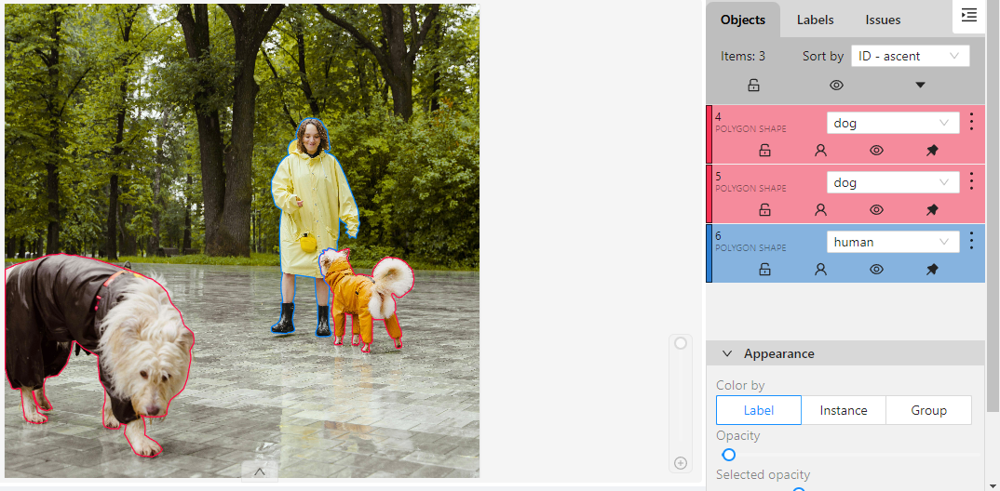
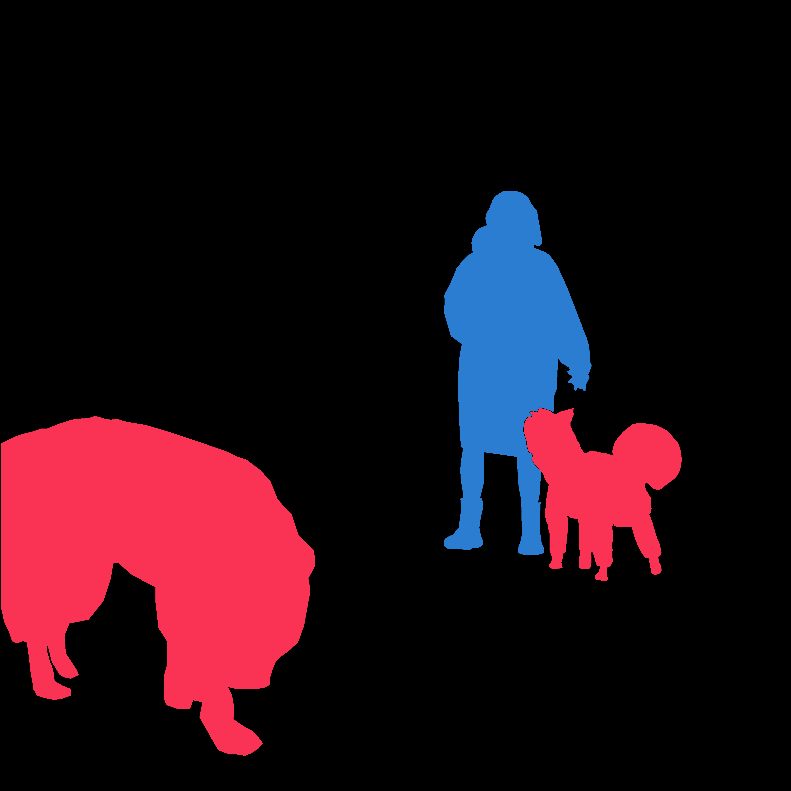
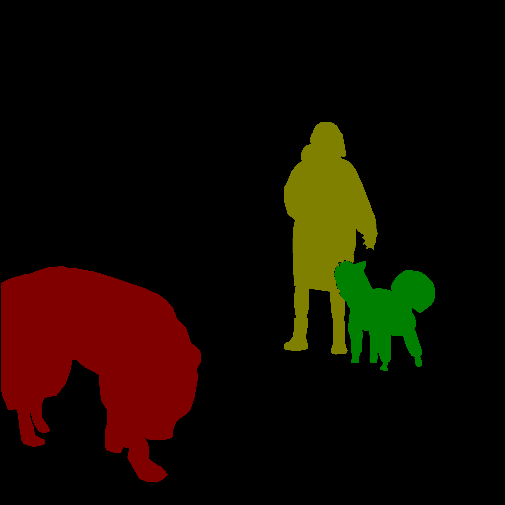

# Convert-Segmentation-Mask-1.1-To-Yolov8
This Python program converts task datasets exported as Segmentation mask 1.1 from [CVAT](https://www.cvat.ai/) into YOLOv8 Instance Segmentation format.

## Features
- Handles multiple classes in a single image.
- Saves labels in a `labels` folder.

## Usage
1. Run the `SegmentationMaskToYolov8.py` script.
2. When prompted, enter the path of the `labelmap.txt` file, `SegmentationClass` folder, and `SegmentationObject` folder.
3. Labels will be saved as text files and stored in a `labels` folder.

### Example Usage


#### Labelmap.txt
```
# label:color_rgb:parts:actions
background:0,0,0::
dog:250,50,83::
horse:255,204,51::
human:42,125,209::
```

#### Example Image 1:

Photo by [Pixabay](https://www.pexels.com/photo/man-on-white-horse-next-to-dog-on-grassy-field-162520/) from Pexels. 

**Resulting Images:**
| SegmentationClass           | SegmentationObject |
| ------------- |:-------------:|
|  |  |

**Output:**
| Label Output       |
| ------------- |
| [pexels-pixabay-162520.txt](assets/labels/pexels-pixabay-162520.txt) |

#### Example Image 2:
 
Photo by [Yaroslav Shuraev](https://www.pexels.com/photo/a-woman-in-yellow-raincoat-training-her-dogs-8499242/) from Pexels. 

**Resulting Images:**
| SegmentationClass           | SegmentationObject |
| ------------- |:-------------:|
|  |  |

**Output:**
| Label Output       |
| ------------- |
| [pexels-yaroslav-shuraev-8499242.txt](assets/labels/pexels-yaroslav-shuraev-8499242.txt) |

## Development Environment
- IDE: Microsoft Visual Studio Community 2022 
- Language: Python 3.9
